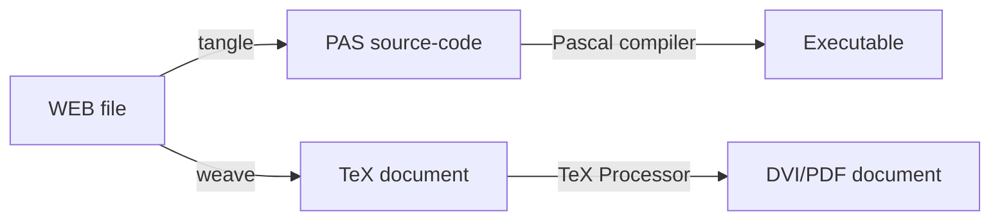
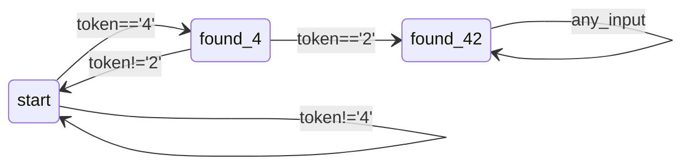
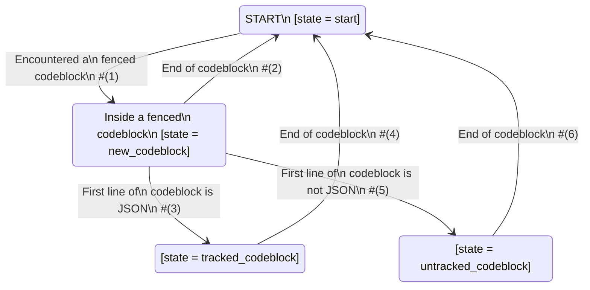

# A new spin on literate programming

Literate programming is a programming-paradigm where the source-code is interspersed with its documentation, such that the author's intent is clear, and the tooling supports both "running the code" and "reading the documentation".

The concept was introduced by Donald Knuth in 1984, in an attempt to develop a workflow suited for both producing programs, and essays about those programs.

> [!Important]
> The main focus of **literate-programming** is producing high-quality documentation, that explains the inner workings of the code (with the drawback that extending the code can be quite slow).

This style is different just adding from Javadoc-style comments, because in Javadoc, the source-code is the primary focus of the file (and the documentation has a secondary role - it is optional and tries to add annotations at a class/method level), while in literate programming, the documentation has an equal or greater importance than the code itself.

Knuth's tooling also solved some practical limitations of the compiler at that time:
* Even if the compiler requires the definitions and declarations in a certain order, the "essay-generation" process can be controlled such that the essay contains another order of the code-blocks, better suited for the reader.
* Since the Pascal compiler didn't support "include"-directives or "macro"-definitions, the literate programming tooling implemented the preprocessor role.

Nowadays, the literate-programming implementations are split into two categories:

* Classic-style tooling: those use a plaintext file containing both code & documentation, and two transformations:
  * `weave` - a transformation that generates a more aesthetically-pleasing human-readable documentation (as opposed to the plaintext). In the original WEB implementation, it took source-files and exported Pascal code.
  * `tangle` - a transformation that exports the bare source-files, to be compiled/interpreted by other tools. In the original WEB implementation, it took source-files and exported TeX code (that can further be transformed into DVI or PDF files).



* Notebook-style tooling: the program is structured as a series of cells, containing either documentation (formatted as markdown, plaintext, html) or code (SQL, Python, Scala), which often generate graphs or data-tables. In this case, the program-execution can only happen from inside its supporting tool. **Jupyter** is such an example. 

Of course, these categories have their own drawbacks:

* For classic-style tooling: modifying the code can be slow (you have to iterate by manually changing the "tangled" source code, and then move the code from the "tangled" file to the "unique source" file). Of course, if the code is supposed to be read often and changed rarely, this might not be an issue (such as in didactic environments).

* For notebook-style tooling: it's not flexible enough, running code has to happen within the editing-tool (and such tools impose restriction on the list of supported languages, and sometimes on the library-versions). It does not play nicely with external tooling.

## Building a Classic-style Literate Programming tool

Let's build such a tool, from scratch, in Ruby, to better understand how it works. This approach is inspired by the [RubyLit article](http://ratfactor.com/repos/rubylit/) - another minimalist tool for literate programming (in only 35 lines of code!). The main improvement in the current project is the support for extracting multiple files from a single literate-file.

> [!NOTE]
> **Why Ruby?:**
> 
> Ruby is a programming language that is perfect for quickly developing tools and demos:
> * It can look like pseudocode.
> * It's a mature and stable language (no syntax changes are expected, no maintenance necessary).
> * It has a large enough standard library (for small projects you don't need to do any setup steps & download libraries).
> * It scales down (you don't have to define classes, modules or mixins if you don't want to).
> * It's an "outsider language" (it's not primarily supported by data-engineering frameworks, so you can be sure that there's no built-in magic involved when doing Spark examples).

### The file-format

First, we have to decide on a format. Starting with Markdown is a reasonable decision, since it supports both text-formatting and embedding code.

In Markdown, one way of including code is by having "fenced-blocks": sections that start with 3-back-quotes (or other "magic sequences") at the beginning of the line, and end with the same sequence of characters on a separate line. Such sequences can be detected using plain regular expressions, so it's feasible. On the line opening the code-block, there is an optional string that specifies to the renderer which syntax-highlight rules to apply. To specify that we want special handling for some of those blocks, we can introduce a rule, that looks for a metadata-json string on the first line of the code-block.

> [!Important]
> **Syntax rule no. 1:** Every fenced codeblock (defined using 3-back-quotes, 4-back-quotes, 3-tildas or 4-tildas) which contains a metadata-json on its first line will be picked up when tangling.

An example could be:

````
```python3
{"filename": "hello.py"}
#!/usr/bin/python3
print("Hello world!")
```
````
  
To allow a code-block to include another named-snippet, we have to introduce another syntax-element, within the scope of "tangled-block" - if a line starts with `<<` and contains the name of another tangled-block, in the exported output that will be equivalent to a preprocessor-include. This, too, can be detected using a line-by-line iteration on the file, and applying a regular expression. Example:

```python3
{"filename": "hello2.py"} 
<<shebang>>
print("Hello world!")
```

And:

```python3
{"name": "shebang"}
#!/usr/bin/python3
```

> [!Important]
> **Syntax rule no. 2:** Using `<<snippet_name>>` is the syntax to include a snippet into another snippet of code.

Of course, the language-annotation from the "code-fence" can be empty, and in that case the Markdown-rendering will show it as plaintext, and the rest will work as usual.
As an example, let's add a license file:

```
{"filename": "LICENSE"}
Copyright (c) 2024 AGILE LAB S.R.L.

Permission is hereby granted, free of charge, to any person obtaining a copy
of this software and associated documentation files (the "Software"), to deal
in the Software without restriction, including without limitation the rights
to use, copy, modify, merge, publish, distribute, sublicense, and/or sell
copies of the Software, and to permit persons to whom the Software is
furnished to do so, subject to the following conditions:

The above copyright notice and this permission notice shall be included in all
copies or substantial portions of the Software.

THE SOFTWARE IS PROVIDED "AS IS", WITHOUT WARRANTY OF ANY KIND, EXPRESS OR
IMPLIED, INCLUDING BUT NOT LIMITED TO THE WARRANTIES OF MERCHANTABILITY
FITNESS FOR A PARTICULAR PURPOSE AND NONINFRINGEMENT. IN NO EVENT SHALL THE
AUTHORS OR COPYRIGHT HOLDERS BE LIABLE FOR ANY CLAIM, DAMAGES OR OTHER
LIABILITY, WHETHER IN AN ACTION OF CONTRACT, TORT OR OTHERWISE, ARISING FROM
OUT OF OR IN CONNECTION WITH THE SOFTWARE OR THE USE OR OTHER DEALINGS IN THE
SOFTWARE.
````

This also clarifies the intent of this project: to be licensed under **MIT License**
(open-source, and easy to integrate into both open and closed-source applications).

### The algorithm

#### Primer on Finite State Machines (FSMs) in Ruby

Finite State Machines (FSMs) are a simple computational model, where the "machine" is defined by a graph of states and transitions, and every input-token triggers a transition in the graph. This computation-model has the advantage that it requires a fixed amount of memory to contain the internal state, and that for every input-token, it only needs a table-lookup to determine the next state.

Let's take a more basic algorithm to see how it matches a Ruby implementation. More precisely, let's build an FSM to check if a list of tokens contains the sub-sequence `['4', '2']`. The diagram below represents the transition-function of the state-machine.



FSMs are typically written in code as a `switch-case` inside a `for-loop`, and the Ruby they follow the same logic.
* The outer `for-loop` (written as `each-do`) reads the input one-token-at-a-time.
* Then inner `switch-case` (written as `case-when`) checks which transition can be applied, based on the current state (represented by the `next_state` variable) and the current token (placed in the `token` variable).
* The variable `next_state` is updated with the new state of the machine, to be used in the next iteration.
 
Note that the names of the states and the conditions are exactly as in the diagram above.

```ruby
{"filename": "fsm.rb"}
#!/usr/bin/env ruby
tokens = ['2', '3', '6', '4', '6', '4', '2', '8']
next_state = :start            # initial state
tokens.each do |token|
  puts "Currently in state #{next_state}, and processing token #{token}."

  case next_state

    # Currently in state = ':start'.
    when :start
      if token == '4'          # Check if current token triggers transition to :found_4.
        next_state = :found_4  # Trigger the transition to :found_4.
      end

      # Self-transitions are implemented implicitly:
      #   next_state = :start
      # would do nothing if the state-variable is already set as such.

    # Currently in state = ':found_4'.
    when :found_4
      if token == '2'          # Check if current token triggers transition to :found_42.
        next_state = :found_42 # Trigger the transition to :found_42.
      else                     # Check if current token triggers transition to :start.
        next_state = :start    # Trigger the transition to :start.
      end

    # Currently in state = ':found_42'.
    when :found_42
      # Here will happen implicit self-transitions.
      # Do nothing: wait for the loop to end.

    else                                      # Incorrect state assignment found.
      raise "Unhandled state #{next_state}."  # Throw exception.
    end
end
```


#### The persistent data-structures

Tangling needs two main dictionaries:
* `files` in the format `(key: String, value: Array(String))`, which describes the top-level file-segments
* `snippets` in the format `(key: String, value: Array(String))`, which describes the named snippets

#### The reading phase

Since the codeblocks can be detected by a simple line-by-line scanning of the file, we'll model the basic algorithm as an FSM.



The code will follow the graph mentioned above, and will be wrote using the same style as the one described in the "Primer on Finite State Machines (FSMs) in Ruby" chapter.
#### The writing phase

To export the **tangled** output, iterate through the `files` dictionary, and attempt to write process its key-value pairs (7).

If the `filename` includes a path-delimiter, then make sure that the directory exists before writing to that path. (8)

Each value represents a file-segment, but every line inside the segment has the potential to be an "include"-element (and pull inline a snippet-segment). For this, we use a recursive function that iterates one-line-at-a-time, and if it finds a reference to another snippet, recursively resolves that "include"-operation. This is basically a recursive Depth-First-Search implementation.(9)

### The tool

Below is the tool's source-code. Understanding the Ruby syntax & particularities is not necessary in order to get a sense of what it's doing. If you've never touched Ruby before, [Ruby in 100 Seconds](https://www.youtube.com/watch?v=UYm0kfnRTJk) is a good introductory video, to get a sense of the language. Numbered comments in the code match-up with the steps in the diagram above or the algorithm explanations.

Note that in Ruby, "Hash" is not related to the cryptographic hash-functions but to hash-tables (dictionaries).

```ruby
{"filename": "literate_tool.rb"}
#!/usr/bin/env ruby
# SPDX-FileCopyrightText: 2024 AGILE LAB S.R.L. <agilelab@pec.it>
# SPDX-License-Identifier: MIT
require 'fileutils'
require 'json'

# Persistent data-structures
files    = Hash.new
snippets = Hash.new

# The reading phase
next_state = :start
fence_type = ''
current_segment_data = nil

# FSM implementation:
# The states, the transitions, and the general structure of the code
# replicate the diagram & code-pattern provided above.
File.read(ARGV[0]).lines.each do |line|
  case next_state
    when :start
      if line.match '^([`~]{3,4})'
        fence_type = line.match('^([`~]{3,4})')[1]
        next_state = :new_codeblock                                     # (1)
      end

    # First line of a fenced code-block - attept to parse it
    when :new_codeblock
      if line.start_with? fence_type
        next_state = :start                                             # (2)
      else
        begin
          metadata             = JSON.parse line
          current_segment_data = Array.new

          puts "Found segment with info #{metadata}."
          if metadata.key? 'filename'
            files.store(metadata['filename'], current_segment_data)
          end
          if metadata.key? 'name'
            snippets.store(metadata['name'], current_segment_data)
          end

          next_state = :tracked_codeblock                               # (3)
        rescue JSON::ParserError
          next_state = :untracked_codeblock                             # (5)
        end
      end

    when :tracked_codeblock
      if not line.start_with? fence_type
        current_segment_data.push line
      else
        next_state = :start                                             # (4)
      end

    when :untracked_codeblock
      if line.start_with? fence_type
        next_state = :start                                             # (6)
      end

    else
      raise "Unhandled state #{next_state}."
    end
end

# The writing phase

def collect_lines(input_line_array, snippets)                           # (9)
  tangled_content = Array.new
  input_line_array.each do |line|
    if not line.start_with? '<<'
      tangled_content.push line
    else
      # Current line includes a snippet, take the name of the snippet and run recursively.
      tangled_content.push collect_lines(snippets[line[2..-4]], snippets)
    end
  end
  tangled_content.join
end

files.each do |filename, contents|                                      # (7)
  puts "Writing file #{filename}."
  if filename.include?('/') and not File.exist? File.dirname(filename)  # (8)
    FileUtils.mkdir_p File.dirname(filename)
  end
  File.write filename, collect_lines(contents, snippets)
end
```

### FAQ

> **Q:** The explanation is ok, but do you have an example of a literate-programming file?

**A:** The markdown file you're reading is a proper literate-programming example. You can "tangle" it into ready-to-run script files.

> **Q:** I don't have the tool installed, and I want to "tangle" this file. Can I just copy-paste the sources from the codeblock above?

**A:** Yes, of course you can! This example was purposely written like this. You just have to remember to delete the first line (containing metadata).

> **Q:** But what about the "weave" process?

**A:** There's no need for it to happen, since the file is already formatted in Markdown, and markdown-renderers handle all the required formatting and syntax-highlight.

> **Q:** Can I use this tool for other programming-languages?

**A:** Yes! It's generic enough that can allows generating any kind of code. The only restriction it imposes on the "payload code" is that it might clash with the include-snippet syntax. Just don't have the following exact sequence at the beginning of a line: `<<` (two open angle-brackets). If the language allows, try to add whitespace before the `<<` in order to avoid matching with the include-snippet syntax.

> **Q:** I have this tool, how do I run it?

**A:** Launch the script, and point it towards a "literate" markdown file.
Follow the example below:

```
> ruby literate_tool.rb Readme.md
Found segment with info {"filename"=>"hello2.py"}.
Found segment with info {"name"=>"shebang"}.
Found segment with info {"filename"=>"LICENSE"}.
Found segment with info {"filename"=>"fsm.rb"}.
Found segment with info {"filename"=>"literate_tool.rb"}.
Writing file hello2.py.
Writing file LICENSE.
Writing file fsm.rb.
Writing file literate_tool.rb.
```

And an alternative, without explicitly invoking the interpreter:

```
> chmod +x literate_tool.rb
> ./literate_tool.rb Readme.md
Found segment with info {"filename"=>"hello2.py"}.
Found segment with info {"name"=>"shebang"}.
Found segment with info {"filename"=>"LICENSE"}.
Found segment with info {"filename"=>"fsm.rb"}.
Found segment with info {"filename"=>"literate_tool.rb"}.
Writing file hello2.py.
Writing file LICENSE.
Writing file fsm.rb.
Writing file literate_tool.rb.
```

## Conclusion

If you've reached this point, congratulations! You've followed along for the creation of a literate-programming tool, able to "unpack" a mixed code+documentation file into multiple source-code files.

As you can see, reading it as a technical document is a good way to get familiar with the concepts and the project. At the same time, extending it would not go as smoothly, since changing the code would mean also updating the documentation-parts, and possibly adapting the main structure of the documentation.

As for the experience of writing the article, I can confirm that by using this tool there's a new perspective of developing the explanations along with the code, and then doing multiple iterations in order to make everything more consistent and clear. Writing the documentation doesn't feel like a chore, but as a puzzle of linking the code with the description of the functionality.

> [!NOTE]
> Some future articles might be formatted as Literate-Programs, since it's the perfect mix between "short code examples that won't be changed in the forseeable future" and "medium-length explanation".

## References

* [RubyLit](http://ratfactor.com/repos/rubylit/) - Major source of inspiration for this article. A similar tool written in 35 lines of Ruby code. Its drawback is that it lacks support for exporting multiple source-files from a single literate-file.
* http://ratfactor.com/cards/literate-programming - Notes associated with using RubyLit.
* [Ruby in 100 Seconds](https://www.youtube.com/watch?v=UYm0kfnRTJk) - Concise description of the Ruby programming language
* [Mr. Neighborly’s Humble Little Ruby Book](https://web.archive.org/web/20160705131837/http://www.humblelittlerubybook.com/book/hlrb.pdf) - Free Ruby Ebook
* <https://rubystyle.guide/> - Recommended coding style for Ruby
* <https://en.wikipedia.org/wiki/Literate_programming> - Wikipedia article
* <http://www.literateprogramming.com/knuthweb.pdf> - Knuth's explanation of the concept
* <https://www.goodreads.com/en/book/show/112245> - Knuth's in depth book
