# Build your own Spark frontends with Spark Connect
# Part 1: The CLI tool

> [!TIP]
> This article is part of a series on Literate Programming: it contains runnable source-code!
> To extract the code from the markdown file, use the tool attached in the [first article of the series](../01-a-new-spin-on-literate-programming/article.md).

This article is intended to fill a void regarding Spark Connect's documentation, as at the time of writing, there are no available tutorials about developing new Spark Connect clients. Spark Connect is a feature meant to simplify the integration of the Spark compute backend with other tools, by using a protocol based on gRPC.

In this article, we'll cover the following topics:
* The basics of gRPC;
* Ruby project organization;
* Writing a client for a protocol developed on top of gRPC;
* Implement a lightweight client for Spark Connect, in Ruby.

By the end of the article we'll have a console-based tool that connects to a Spark server, submits an SQL query, and prints the resulting table back on the console.

## The theoretical side
### A gRPC intro

[**gRPC**](https://grpc.io/) is a language-agnostic client-server communication framework, that relies on shared protocol-descriptions and code-generators, in order to simplify the programmer's work in writing client-side and server-side applications.

The protocol-description files are formal specifications for the messages (data-structures) that will be exchanged between the server and the client, expressed in a platform-independent way.

Then, the code-generator component will read those protocol-description files and generate libraries (for a number of available programming languages, both for server-side and client-side applications) that implement those protocols. The generated library attempts to solve most of the issues arising from networking and cross-platform interoperability (handshakes, endianness, data-serialization, compression, handling interrupted connections) - leaving the developer with the task of writing the high-level part of the application (the business logic).

What sets gRPC apart from the typical HTTP request-response flows is the support for result-streams: sequences (possibly infinite, or until the client stops the connection) of response-messages, such that even for long-running tasks you can have up-to-date information from the server, without relying on workarounds like frequent polling.

```mermaid
sequenceDiagram
  participant 🧑‍💻 Client
  participant 🤖 Server

  🧑‍💻 Client->>🤖 Server: Hey, please run this query!
  🤖 Server->>🧑‍💻 Client: Sure! I'm opening a stream! Here are a bunch of results...
  🤖 Server->>🧑‍💻 Client: Here are more results...
  🤖 Server->>🧑‍💻 Client: These are the last results! End of stream!
```



### A few words on Apache Arrow

[**Apache Arrow**](https://arrow.apache.org/) is a cross-platform table serialization algorithm, organized internally as a columnar data-format, optimized for in-memory analytics.

It relies on the [FlatBuffers](https://flatbuffers.dev/) serialization library to efficiently serialize and deserialize information, and it ships with bindings for most popular programming languages.

### A quick introduction to Spark Connect

[**Spark Connect**](https://spark.apache.org/docs/latest/spark-connect-overview.html) is a feature introduced in Spark 3.4, that implements a gRPC interface and a server for interacting with a Spark cluster.

Once a Spark Connect server-instance is launched on a driver-node, that server will listen for gRPC connections, decode the messages it receives, translate them to sequences of Spark dataframe operations, and run them on the attached worker-nodes.

Once the results become available on the Spark Connect server, those are sent back to the originating client, as a stream of Arrow-encoded table fragments.

## The protocol's specification

Since the Spark Connect server waits for gRPC messages, it is logical to search for how these messages look like. The protocol specification for Spark version 3.5 is available on the [apache/spark GitHub repository](https://github.com/apache/spark/tree/branch-3.5/connector/connect/common/src/main/protobuf/spark/connect), split up across multiple files.

> [!WARNING]
> The location of the protocol's specification will be changed in the upcoming 4.0 release, to be at <https://github.com/apache/spark/tree/master/sql/connect/common/src/main/protobuf/spark/connect>.

The first part we must focus on is in `base.proto`:

```protobuf
service SparkConnectService {
  // Executes a request that contains the query and returns a stream of [[Response]].
  //
  // It is guaranteed that there is at least one ARROW batch returned even if the result set is empty.
  rpc ExecutePlan(ExecutePlanRequest) returns (stream ExecutePlanResponse) {}
}
```

This says that the server can be asked to run `ExecutePlan` actions, with an argument of  
type `ExecutePlanRequest`, and will return a stream of `ExecutePlanResponse` replies.

```mermaid
sequenceDiagram
  participant 🧑‍💻 Client
  participant server as 🤖 Spark Connect Server <br/> TCP Port 15002
  participant ⚙️ Spark Executors

  🧑‍💻 Client->>server: Run ExecutePlan using ExecutePlanRequest argument!
  server->>⚙️ Spark Executors: Run this Spark Job!
  ⚙️ Spark Executors->>server: Partial result.
  server->>🧑‍💻 Client: ExecutePlanResponse containing data.
  ⚙️ Spark Executors->>server: Partial result.
  server->>🧑‍💻 Client: ExecutePlanResponse containing data.
  ⚙️ Spark Executors->>server: Partial result.
  server->>🧑‍💻 Client: ExecutePlanResponse containing data. End of stream!
```



### The request

Looking deeper into the definitions, we will find the specification for the `ExecutePlanRequest` message.
This protocol is mostly undocumented from the developer's perspective: the only place explaining the semantics of the fields is in the protocol's definition, presented as inline comments.

To make the lookup easier, below is a simplified reproduction of the protocol specification, with the original comments, combined from `base.proto` and `relations.proto`. At the first sight it might feel overwhelming, but at the same time, that's the full extent of the protocol's documentation at the time of writing.

> [!NOTE]
> The numbers associated with every field are tags, and those tags must be unique within the type definition. These are not default values.

```protobuf
// A request to be executed by the service.
message ExecutePlanRequest {
  // (Required)
  //
  // The session_id specifies a spark session for a user id (which is specified
  // by user_context.user_id). The session_id is set by the client to be able to
  // collate streaming responses from different queries within the dedicated session.
  // The id should be an UUID string of the format `00112233-4455-6677-8899-aabbccddeeff`
  string session_id = 1;

  // (Required) User context
  //
  // user_context.user_id and session+id both identify a unique remote spark session on the
  // server side.
  UserContext user_context = 2;

  // (Required) The logical plan to be executed / analyzed.
  Plan plan = 3;
}

// User Context is used to refer to one particular user session that is executing
// queries in the backend.
message UserContext {
  string user_id = 1;
  string user_name = 2;
}

// A [[Plan]] is the structure that carries the runtime information for the execution from the
// client to the server. A [[Plan]] can either be of the type [[Relation]] which is a reference
// to the underlying logical plan or it can be of the [[Command]] type that is used to execute
// commands on the server.
message Plan {
  oneof op_type {
    Relation root = 1;
    Command command = 2;
  }
}

// The main [[Relation]] type. Fundamentally, a relation is a typed container
// that has exactly one explicit relation type set.
//
// When adding new relation types, they have to be registered here.
message Relation {
  RelationCommon common = 1;
  oneof rel_type {
    SQL sql = 10;
  }
}

// Common metadata of all relations.
message RelationCommon {
  // (Required) Shared relation metadata.
  string source_info = 1;
}

// Relation that uses a SQL query to generate the output.
message SQL {
  // (Required) The SQL query.
  string query = 1;
}
```

To translate it into Ruby code, there is [a helpful guide](https://protobuf.dev/reference/ruby/ruby-generated/) that explains the mapping between the gRPC-specification and Ruby concepts. This is how a minimal `ExecutePlanRequest` instance looks like, when submitting an SQL Query:

```ruby
{"name": "ExecutePlanRequestSetup"}
      plan = ExecutePlanRequest.new(
        session_id: session_uuid,
        user_context: UserContext.new(
          user_id: @client_uuid,
          user_name: @client_name
        ),
        plan: Plan.new(
          root: Relation.new(
            common: RelationCommon.new(
              source_info: '?'
            ),
            sql: SQL.new(
              query: sql_query
            )
          )
        )
      )

```

### The response

Now let's focus on the data-types used by the response. We expect to receive a stream of `ExecutePlanResponse` objects, and we're looking into how single objects look like:

```protobuf
// The response of a query, can be one or more for each request. Responses belonging to the
// same input query, carry the same `session_id`.
message ExecutePlanResponse {
  // Union type for the different response messages.
  oneof response_type {
    ArrowBatch arrow_batch = 2;
  }

  // Batch results of metrics.
  message ArrowBatch {
    int64 row_count = 1;
    bytes data = 2;
  }
}
```

Translating it into code, handling a stream of structures looks like this:

```ruby
{"name": "ExecutePlanResponseStreamRead"}
      arrow_data = Array.new

      result_stream.each do |r|
        if r.response_type == :arrow_batch
          arrow_data.push r.arrow_batch.data
        elsif @log_errors
          puts 'Unhandled response'
          puts r
        end
      end

```

Here, the gRPC code-generator has exposed the stream of results as a list (named `result_stream`), hiding some of the complexity in the process:
* Asking for the next element of the list blocks the execution of the current thread, until that data becomes available client-side.
* Once the server finishes sending the data and ends the stream, it will look like we have reached the end of the list.

Of course, the `response_type` supports multiple types of information, but to keep the example simple we'll handle just the `arrow_batch` type, and log the others responses on the console.

## The scripts
### A simple gRPC wrapper

We'll structure the code related to gRPC communication as a separate module with a singleton-class, in order to reuse it later.

The expression `class << self` defines a singleton object inside the module ([reference](https://stackoverflow.com/a/2505077)). Functionally, methods defined inside the singleton object will be equivalent to Java's public static methods - they can be called from anywhere, without requiring a class instance to be present. From the syntactic point of view, function-calls done using the module's name will be propagated to the singleton object's function implementations.

The `include Spark::Connect` directive pulls the entire namespace `Spark::Connect` into the current scope (such that we can create objects defined in the `Spark::Connect` namespace without writing the entire prefix each time).

```ruby
{"filename":"spark_connect_handler.rb"}
=begin
<<spdx_id>>
=end

require 'securerandom'
<<SparkConnectHandlerLoadPathWorkaround>>
require 'spark/connect/base_services_pb'

module SparkConnectHandler
  class << self
    include Spark::Connect

<<SparkConnectHandlerFields>>
<<SparkConnectHandlerStartStub>>
<<SparkConnectHandlerRunSparkConnect>>
  end
end
```

This singleton object has three public fields:
* `client_name` - the human-readable name it will use to identify to the Spark Connect server. Used in the `UserContext` data-structure.
* `client_uuid` - the UUID used when identifying to Spark Connect. Used in the `UserContext` data-structure. Although Spark Connect does not handle authentication, it will log and display a list of connected clients.
* `log_errors` - a boolean flag, that controls the verbosity of the messages logged to the console.

> [!NOTE]
> In Ruby, **fields are always private** while by default **all methods are public**.
>
> In order to simulate a public field, one must use getter-functions and setter-functions.
> The [`attr_accessor`](https://docs.ruby-lang.org/en/3.3/Module.html#method-i-attr_accessor) method is a shortcut from the Ruby's core that implements "public" fields, by adding implicit getters and setters.
> This method uses metaprogramming, to create fields, getters and setters for each of its arguments, and attach those to the class it finds itself in.

```ruby
{"name": "SparkConnectHandlerFields"}
    attr_accessor :client_name, :client_uuid, :log_errors

```

This module also has two main functions:
* `start_stub(spark_connect_url)` - Receives the URL of a Spark Connect server, initializes a gRPC client object, and returns that client. The constructor-method `SparkConnectService::Stub.new` is implemented by the gRPC code-generator and placed in the protocol's library.
```ruby
{"name": "SparkConnectHandlerStartStub"}
    def start_stub(spark_connect_url)
      SparkConnectService::Stub.new(
        spark_connect_url,
        :this_channel_is_insecure
      )
    end

```

* `run_spark_connect(stub, sql_query, session_uuid: SecureRandom.uuid)` - Receives a Spark connect client, an SQL query (set up as a string) and an optional `session_uuid` (if it's not passed by the caller, a new UUIDv4 will be generated). This method returns an array of Arrow batches in binary form. These Arrow batches will need to be converted to proper Arrow objects, and merged to form a single table. 

```ruby
{"name": "SparkConnectHandlerRunSparkConnect"}
    def run_spark_connect(stub, sql_query, session_uuid: SecureRandom.uuid)
<<ExecutePlanRequestSetup>>
      result_stream = stub.execute_plan plan
<<ExecutePlanResponseStreamRead>>
      arrow_data
    end
```

There is one more detail: the gRPC code generator expects that its code is always placed in the project's root. Since we're not taking that approach, and everything that is auto-generated is placed into the `generated` directory, we have to use a trick: to append the `generated` directory to the lookup path used by the Ruby interpreter (called `$LOAD_PATH`) just before doing the `require 'spark/connect/base_services_pb'` line ([reference](https://github.com/protocolbuffers/protobuf/issues/1137)).

```ruby
{"name": "SparkConnectHandlerLoadPathWorkaround"}

lib_dir = File.join(__dir__, 'generated')
$LOAD_PATH.unshift(lib_dir) unless $LOAD_PATH.include?(lib_dir)

```

### A simple CLI tool

Let's integrate the handler module into a CLI tool. The script has the following structure:

```ruby
{"filename": "connect_query.rb"}
#!/usr/bin/env ruby
=begin
<<spdx_id>>
=end
require 'arrow'
require 'terminal-table'

require_relative 'spark_connect_handler'

<<ConnectQueryFields>>
<<ConnectQueryStartStub>>
<<ConnectQueryRunStub>>
<<ConnectQueryDecodeArrow>>
<<ConnectQueryPrintTable>>
```

And going into the file's sections, one-by-one:

* initialize SparkConnectHandler's static fields (set up the client's metadata);
```ruby
{"name": "ConnectQueryFields"}
SparkConnectHandler.client_name = 'cli-fronted'
SparkConnectHandler.client_uuid = '1dc3bfb4-c16f-4be4-8719-b7731dd251d4'
SparkConnectHandler.log_errors  = false

```

* start a connection to the Spark Connect server, using the address passed as the first command-line parameter (`ARGV[0]`);
```ruby
{"name": "ConnectQueryStartStub"}
spark_connect_stub = SparkConnectHandler.start_stub ARGV[0]

```

* run the query passed in the second command-line parameter (`ARGV[1]`);
```ruby
{"name": "ConnectQueryRunStub"}
arrow_data = SparkConnectHandler.run_spark_connect spark_connect_stub, ARGV[1]

```

* merge together the batches of Arrow-formatted data (using the [red-arrow](https://github.com/apache/arrow/tree/main/ruby/red-arrow) gem);
```ruby
{"name": "ConnectQueryDecodeArrow"}
tables = arrow_data.map { |t| Arrow::Table.load(Arrow::Buffer.new(t)) }
concatenated = tables.first.concatenate tables.drop(1)

```

* pretty-print the data (using the [terminal-table](https://github.com/tj/terminal-table) gem)
```ruby
{"name": "ConnectQueryPrintTable"}
table = Terminal::Table.new do |t|
  t.style = { border: :unicode_round }
  t.headings = concatenated.column_names

  concatenated.each_record do |batch|
    t << batch.to_a
  end
end

puts table
```

At this point, the important parts of the project are ready - we have seen the code used to set up the communication, send a request, and render the response-table in the terminal. What follows is the project's setup, specific to the Ruby environment.

## Setting up a Ruby project

We've finished discussing about the application in general, but we still need to set up a couple of things before being ready to run it:
* Dependency management - `bundle`
* Build tools - `rake`
* Licensing info - `LICENSE`

These are necessary, in order to have a complete project, but fortunately, they are quite compact. After everything is set up, the directory of the project will look like this:
```
.
├── spark_connect_handler.rb  #  ⎱ Source Code
├── connect_query.rb          #  ⎰ 
├── Gemfile         #  ⎫
├── .bundle         #  ⎬ Dependency Management 
│   └── config      #  ⎭
├── Rakefile     #  } Build Commands
├── LICENSE      #  } Licensing Information
├── lib                                 #  ⎫
│   └── spark                           #  ⎬ Language-independent gRPC interface files
│       └── connect                     #  ⎪
│           └── [...].proto             #  ⎭
├── generated                        #  ⎫
│   └── spark                        #  ⎪
│       └── connect                  #  ⎬ Result of gRPC code-generation
│           ├── base_services_pb.rb  #  ⎪
│           └── [...]_pb.rb          #  ⎭
└── vendor                        #  ⎫
    └── bundle                    #  ⎬ Dependencies (gems)
        └── [...]                 #  ⎭
```

### Bundle

**[Bundle](https://bundler.io/)** is Ruby's package manager: the piece of code that downloads & installs libraries. `Bundle` is part of a typical Ruby installation, so if you already have "ruby" installed, you probably already have the `bundle` tool on your system.

Ruby libraries are generally called "gems", and the public gem repository is available at [rubygems.org](https://rubygems.org/).

The list of dependencies is held in a file called `Gemfile`, like the one below.

```ruby
{"filename": "Gemfile"}
source 'https://rubygems.org'
gem 'rake'           # Build-tool
gem 'grpc'           # gRPC runtime library          ⎫
gem 'grpc-tools'     # gRPC code-generator           ⎬ Spark Connect Dependencies
gem 'red-arrow'      # Arrow-format decoder library  ⎭
gem 'terminal-table' # Pretty-printer for tables
```

By default, gems are installed in a global path (used by the all projects on that machine), but we can instruct `bundle` to use a project-specific path, by adding another project configuration file:

```ruby
{"filename": ".bundle/config"}
---
BUNDLE_PATH: 'vendor/bundle'
```
With this configuration, all the dependencies will be installed in the `vendor/bundle` directory.
And then, we can run the `bundle` tool, to actually download these libraries, by doing

```bash
➤ bundle install
```

>[!NOTE]
> The `bundle` tool is also called `bundler` - the names are interchangeable.

### Rake

**[Rake](https://github.com/ruby/rake)** is Ruby's implicit build-tool, similar to the Unix's `make`.
And to continue the analogy, instead of `Makefiles` , `rake` uses `Rakefiles`, where various build-tasks get defined.

Since Ruby is an interpreted language, we won't need the typical "compile" steps, but we still need to download the `*.proto` interface files from the Internet, and run the code-generator that writes the gRPC-based communication library

This `Rakefile` is written using [Rake Domain Specific Language (DSL)](https://ruby.github.io/rake/Rake/DSL.html).

```ruby
{"filename": "Rakefile"}
=begin
<<spdx_id>>
=end

require 'net/http'
require 'securerandom'

<<TaskLibSparkConnect>>
<<TaskGenerated>>
<<TaskSetup>>
<<TaskClean>>
<<TaskGenerateUUID>>
```

Rake tasks are similar to function definitions - they're basically names associated with blocks of Ruby code.
To see how these are defined, let's look at a simple task: `generate_uuid` - it generates a random UUIDv4 and prints it on the console. The keyword [`task`](https://ruby.github.io/rake/Rake/DSL.html#method-i-task) is part of the Rake's DSL, and specifies the task's name, its dependencies and its proper action.

The [`desc`](https://ruby.github.io/rake/Rake/DSL.html#method-i-desc) keyword is also part of the Rake's DSL, that assigns to the next "task" a human-readable description.

```ruby
{"name": "TaskGenerateUUID"}
desc 'Print a fresh UUIDv4 value.'
task :generate_uuid do
  puts "Your UUIDv4 is: #{SecureRandom.uuid}"
end

```

Let's focus on another task: `clean` - delete the `generated` and `lib` directories, since we can always recover them.
This follows the convention that running `make clean` deletes everything that is auto-generated, while keeping only the source-code.

Note that the [`rm_rf`](https://docs.ruby-lang.org/en/3.3/FileUtils.html#method-i-rm_rf) method is implemented by the Ruby's standard library.

```ruby
{"name": "TaskClean"}
desc 'Discard the auto-generated files.'
task :clean do
  rm_rf ['lib', 'generated']
end

```

Sometimes, we're interested in tasks that generate files (or similar objects) in the filesystem, and if those objects already exist, the task should be considered completed. This is where the [`file`](https://ruby.github.io/rake/Rake/DSL.html#method-i-file) element of the DSL comes in.

In the case of the `generated` task, if this object exists on the filesystem, the task is considered done. If it does not exist, the directory is created, and then the gRPC code-generator is called to populate it with the protocol-specific library.
The [`mkdir_p`](https://docs.ruby-lang.org/en/3.3/FileUtils.html#method-i-mkdir_p) method is part of the standard library.
Rake makes available by default the [`sh`](https://ruby.github.io/rake/FileUtils.html#method-i-sh) function, that runs arbitrary shell-commands.

It also specifies a dependency: the `lib/spark/connect` task must be run before beginning to execute the current target.

```ruby
{"name": "TaskGenerated"}
file 'generated' => ['lib/spark/connect'] do |p|
  mkdir_p p.name
  sh "grpc_tools_ruby_protoc --ruby_out=#{p.name} --grpc_out=#{p.name} --proto_path=lib lib/spark/connect/*"
end

```

Since we're talking about Ruby code, the tasks have no limit in their complexity. The following example is the task `'lib/spark/connect'` - that downloads the gRPC protocol's specifications from the GitHub repository and saves on the filesystem.

```ruby
{"name": "TaskLibSparkConnect"}
$protofiles = ['base', 'catalog', 'commands', 'common', 'example_plugins', 'expressions', 'relations', 'types']
$reference_branch = 'branch-3.5'

file 'lib/spark/connect' do |p|
  mkdir_p p.name
  $protofiles.each do |filename|
    # For the current development branch (intended for 4.x release) the URL path was changed to:
    #          https://raw.githubusercontent.com/apache/spark/#{$reference_branch}/sql/connect/common/src/main/protobuf/spark/connect/#{filename}.proto
    uri = URI("https://raw.githubusercontent.com/apache/spark/#{$reference_branch}/connector/connect/common/src/main/protobuf/spark/connect/#{filename}.proto")
    resp = Net::HTTP.get(uri)
    puts "Downloaded #{filename}.proto."
    target_filename = "#{p.name}/#{filename}.proto"
    File.open(target_filename, 'w') { |file| file.write(resp) }
    puts "Saved #{target_filename}."
  end
end

```

And for convenience, let's define an alias, such that calling `rake setup` triggers the entire setup process, since it's more intuitive to run `rake setup` instead of `rake generated`.

```ruby
{"name": "TaskSetup"}
desc 'Perform the one-time-setup for the project'
task :setup => [:generated]

```

To see all the commented tasks (the ones preceded by a `desc` call):
```bash
➤ bundle exec rake --tasks
rake clean          # Discard the auto-generated files
rake generate_uuid  # Print a fresh UUIDv4 value
rake setup          # Perform the one-time-setup for the project
```

To see all the available tasks, even those that are "uncommented":
```bash
➤ bundle exec rake --all --tasks 
rake clean              # Discard the auto-generated files
rake generate_uuid      # Print a fresh UUIDv4 value
rake generated          # 
rake lib/spark/connect  # 
rake setup              # Perform the one-time-setup for the project
```

To run a task:
```bash
➤ bundle exec rake setup
```

Here, `bundle exec` means "run the command using the environment & gems downloaded in the local project, don't look into the system's PATH, but into the project's specific dependencies", `rake` is the invokation of the tool, and its parameter - `setup` is the name of the task that we want to run.

Note that `grpc_tools_ruby_protoc` was downloaded as part of the `grpc-tools` gem at `vendor/bundle/ruby/.../bin/grpc_tools_ruby_protoc`. You can manually call this tool as:

```bash
➤ bundle exec grpc_tools_ruby_protoc --ruby_out=generated --grpc_out=generated --proto_path=lib lib/spark/connect/*
```

### Licensing

In order to make this code and document reusable and redistributable, let's make it clear that it's intended to have an **MIT License**:

```
{"filename": "LICENSE"}
Copyright (c) 2024 AGILE LAB S.R.L.

Permission is hereby granted, free of charge, to any person obtaining a copy
of this software and associated documentation files (the "Software"), to deal
in the Software without restriction, including without limitation the rights
to use, copy, modify, merge, publish, distribute, sublicense, and/or sell
copies of the Software, and to permit persons to whom the Software is
furnished to do so, subject to the following conditions:

The above copyright notice and this permission notice shall be included in all
copies or substantial portions of the Software.

THE SOFTWARE IS PROVIDED "AS IS", WITHOUT WARRANTY OF ANY KIND, EXPRESS OR
IMPLIED, INCLUDING BUT NOT LIMITED TO THE WARRANTIES OF MERCHANTABILITY
FITNESS FOR A PARTICULAR PURPOSE AND NONINFRINGEMENT. IN NO EVENT SHALL THE
AUTHORS OR COPYRIGHT HOLDERS BE LIABLE FOR ANY CLAIM, DAMAGES OR OTHER
LIABILITY, WHETHER IN AN ACTION OF CONTRACT, TORT OR OTHERWISE, ARISING FROM
OUT OF OR IN CONNECTION WITH THE SOFTWARE OR THE USE OR OTHER DEALINGS IN THE
SOFTWARE.
```

In other words, you're free to modify, reuse, or distribute this document and the code, as long as you still give credits to the original authors.

To make it work with tools like SPDX, we'll also add the following metadata at
the beginning of the files ([reference related to the SPDX metadata](https://reuse.software/faq/)):

```ruby
{"name": "spdx_id"}
# SPDX-FileCopyrightText: 2024 AGILE LAB S.R.L. <agilelab@pec.it>
# SPDX-License-Identifier: MIT
```
This way, a code-crawler will be able to assign the code-ownership automatically when encountering a source-code file.

## The demo
### Prerequisites

The project requires a reasonably recent version of `ruby` (3.x or newer) and the `libarrow` libraries for C++ & Glib (C). The installation instructions are available at <https://arrow.apache.org/install/>. Also, in order to launch a Spark Connect server, you'll need a **supported Java JDK** (version 8, 11 or 17).

```bash
➤ sudo apt install lsb-release wget
➤ wget https://apache.jfrog.io/artifactory/arrow/$(lsb_release --id --short | tr 'A-Z' 'a-z')/apache-arrow-apt-source-latest-$(lsb_release --codename --short).deb
➤ sudo apt install ./apache-arrow-apt-source-latest-$(lsb_release --codename --short).deb
➤ sudo apt update
➤ sudo apt install ruby ruby-dev bundler libarrow-dev libarrow-glib-dev openjdk-17-jdk-headless build-essential
# or
➤ brew install ruby apache-arrow apache-arrow-glib openjdk@17
```

### Install and run

Download and unpack the Spark release archive. Start the Spark Connect server (by default it will listen for gRPC traffic on `localhost:15002` and will show a web interface at <http://localhost:4040/>):

```bash
➤ wget https://archive.apache.org/dist/spark/spark-3.5.3/spark-3.5.3-bin-hadoop3.tgz
➤ tar zxf spark-3.5.3-bin-hadoop3.tgz
➤ cd spark-3.5.3-bin-hadoop3 
➤ ./sbin/start-connect-server.sh --packages org.apache.spark:spark-connect_2.12:3.5.3
```

To start the Spark Connect server on a custom address, set the `spark.connect.grpc.binding.address` and `spark.connect.grpc.binding.port` configuration keys. Follow the snippet below for a concrete example (where `0.0.0.0` conventionally means "listen on all available IP interfaces"):

```bash
➤ ./sbin/start-connect-server.sh \
  --packages org.apache.spark:spark-connect_2.12:3.5.3 \
  --conf spark.connect.grpc.binding.address=0.0.0.0 \
  --conf spark.connect.grpc.binding.port=5000
```

> [!NOTE]
> More configuration keys are [documented inside the Spark source code](https://github.com/apache/spark/blob/branch-3.5/connector/connect/server/src/main/scala/org/apache/spark/sql/connect/config/Connect.scala).  
> For releases newer than Spark 4.0, the path needs updating to [a new location](https://github.com/apache/spark/blob/master/sql/connect/server/src/main/scala/org/apache/spark/sql/connect/config/Connect.scala).


Extract the files from the Markdown and run the setup steps:
```bash
➤ ruby literate_tool.rb article.md
➤ bundle install
➤ bundle exec rake setup
```

> [!TIP]
> Use `ruby -w` to print warnings detected by the interpreter.  
> Those warnings typically indicate possible misconfigurations or use of features that will soon be deprecated. 

Launch a query:
```bash
➤ bundle exec ruby -w connect_query.rb localhost:15002 'SELECT EXPLODE(SEQUENCE(200, 204)) AS e'

╭─────╮
│ e   │
╞═════╡
│ 200 │
│ 201 │
│ 202 │
│ 203 │
│ 204 │
╰─────╯
```
## Conclusion

If you've made it to this point, congratulations! You now know how to launch Spark workloads from any modern programming language!

While the code is not complete, nor secure, it's still useful! It constitutes a good starting point for niche application customization, or for reapplying the concepts to other languages. Feel free to adapt the code above to fulfill other tasks, such as checking data-quality indicators or the validity of the backup-tables from shell-scripts.

If you're interested in doing something similar for real-world scenarios, be aware of the following limitations:
* The error messages are not handled (in case of communication errors or syntax-errors).
* Authentication is not handled: Spark Connect assumes it communicates over a secure network, so anyone can connect over gRPC and submit queries to it.
* Most of the `Relation` types are not handled here, so the results will any miss additional information sent by the server.
